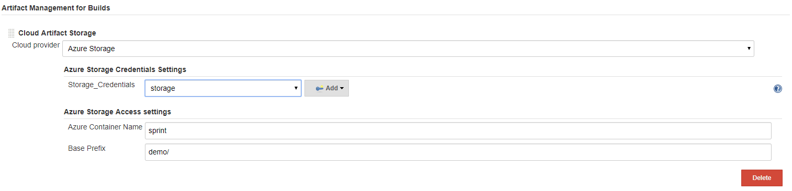
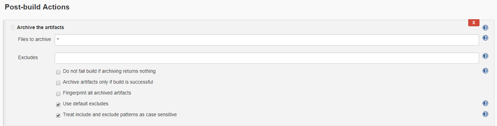

# Azure Artifact Manager Plugin

Azure Artifact Manager plugin is an Artifact Manager that allows you store your artifacts into Azure Blob Storage. Azure Artifact Manager plugin works transparently to Jenkins and your jobs, it is like the default Artifact Manager.

## Configuration

1. At least one Azure storage account must be configured in the global configuration before the plugin can be used in build steps. To add a storage account, go to Manage Jenkins | Configure System | Microsoft Azure Storage Account Configuration and fill out the needed information.

2. In Manage Jenkins | Configure System | Artifact Management for Builds, choose Azure Storage as the cloud provider. Choose the storage Credentials created in step one, and choose your container name and prefix.



## Usage

To use Azure Artifact Manager, you can use the artifact step to archive/unarchive, and the stash/unstash step as you usually do. 

### Pipeline Job

Azure Artifact Manager plugin can be used in a pipeline job. You can use `archiveArtifacts` step to archive artifacts into Azure Blob Storage.

```
node() {
    //...
    stage('Archive') {
        archiveArtifacts "pattern"
    }
}
```

To unarchive artifacts, you can use the `unarchive` step which will retrieve the artifacts from Azure Blob Storage.

```
node() {
    //...
    stage('Unarchive') {
        unarchive mapping: ["pattern": '.']
    }
}
```

To save a set of files so that you can use them later in the same build(generally on another node or workspace), you can use `stash` step to store files into Azure Blob Storage for later use.

```
node() {
    //...
    stash name: 'name', includes: '*'
}
```

You can use `unstash` step to retrieve the files saved with `stash` step from Azure Blob Storage to the local workspace.

```
node() {
    //...
    unstash 'name'
}
```

### FreeStyle Job

For FreeStyle jobs, you can archive artifacts by adding a `Post-build Actions` of type `Archive the artifacts`, and this will use the Azure Artifact Manager plugin to store the artifacts into Azure Blob Storage.



## Contributing

This project welcomes contributions and suggestions.  Most contributions require you to agree to a
Contributor License Agreement (CLA) declaring that you have the right to, and actually do, grant us
the rights to use your contribution. For details, visit https://cla.microsoft.com.

When you submit a pull request, a CLA-bot will automatically determine whether you need to provide
a CLA and decorate the PR appropriately (e.g., label, comment). Simply follow the instructions
provided by the bot. You will only need to do this once across all repos using our CLA.

This project has adopted the [Microsoft Open Source Code of Conduct](https://opensource.microsoft.com/codeofconduct/).
For more information see the [Code of Conduct FAQ](https://opensource.microsoft.com/codeofconduct/faq/) or
contact [opencode@microsoft.com](mailto:opencode@microsoft.com) with any additional questions or comments.
